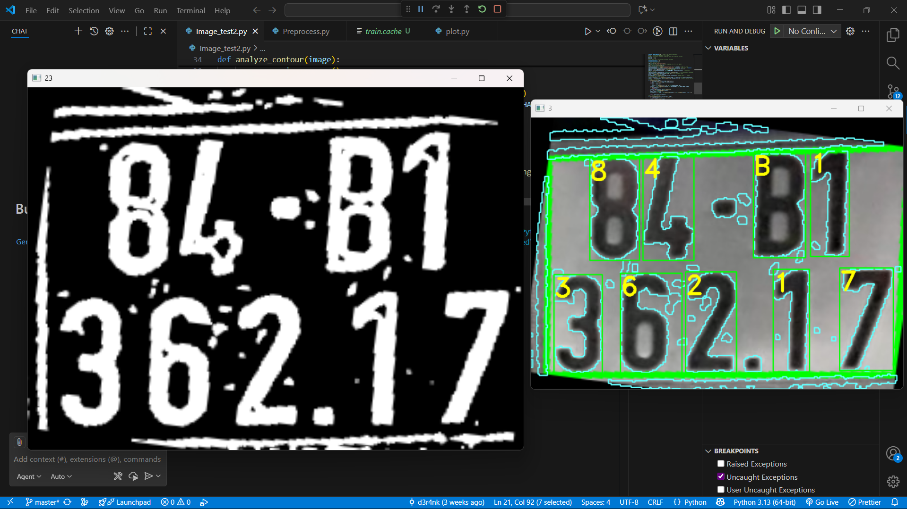
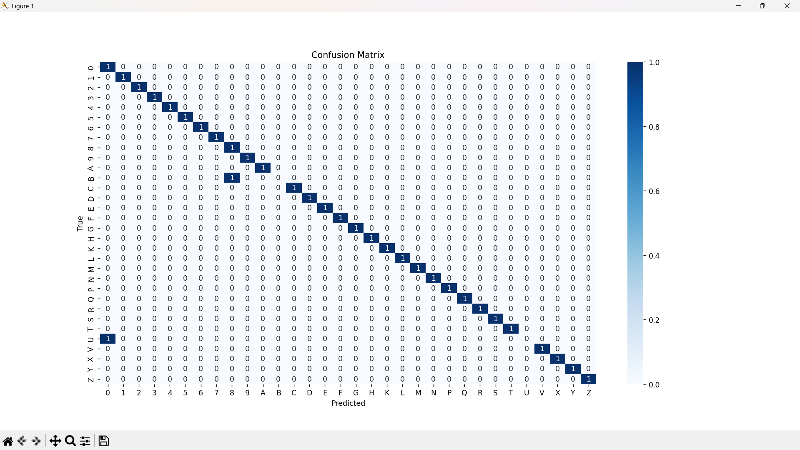
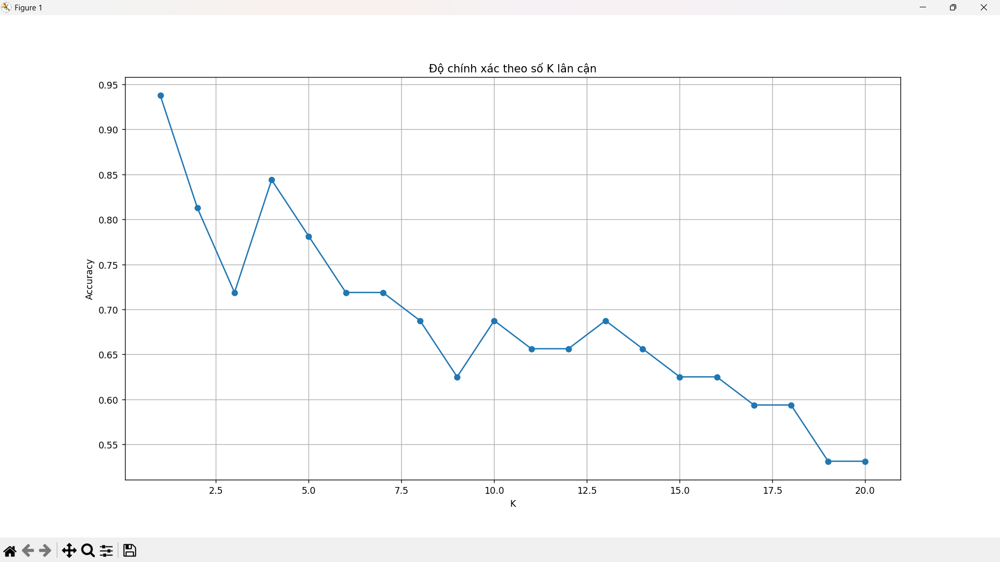

# License Number Detect

## Overview
**License Number Detect** is a lightweight pipeline for detecting and recognizing license plate characters from images. The system performs plate localization, character segmentation, and OCR classification using a K-Nearest Neighbors (KNN) model. It is designed for fast inference and easy experimentation.

### Handling commonly confused characters (k fallback)
In practice, certain characters are visually ambiguous (e.g., **0 ↔ O** and **1 ↔ I**). To improve per-character precision on these cases, the pipeline includes a **rule-based fallback**:
- When the predicted character belongs to the ambiguous set **{0, O, 1, I}**, the classifier **falls back to `k = 1`** (nearest neighbor only) for that position, overriding the default `k` used elsewhere.
- This targeted fallback sharpens the decision boundary and reduces flips among those four characters without affecting the rest of the string.

> Result: overall accuracy benefits from a conservative, high-precision decision on the four commonly confused characters, while keeping the global model stable.

---

## Technologies in Use
- **Python** – Core implementation
- **OpenCV** – Image preprocessing, plate detection, and character segmentation
- **scikit-learn (KNN)** – Character classification with tunable `k`
- **NumPy** – Array operations and feature preparation
- **Matplotlib** – Metrics visualization (accuracy curves, confusion matrix)

---

## Screenshots
Below are a few key visuals from the `assets/` folder illustrating the system’s behavior and performance.

### Demo

### Confusion Matrix
Shows per-class performance and major confusions captured during evaluation.

### Accuracy vs K
Helps choose a reasonable global `k` while relying on the k=1 fallback for the four ambiguous characters.

